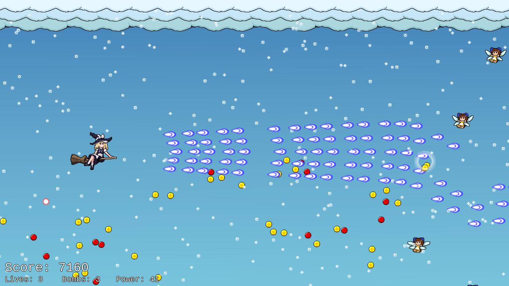

# A certain magical shooter



I made a simple Shmup, trying to get better at Art/Sound/Music, hopefully you'll enjoy the results.

## [Play the game](https://melchizedek6809.github.io/touhou-jam-10/)


## Dev Requirements
- Node JS (v18+) with NPM

## Setup
You need to run the build step once before starting a dev server so that the extruded tileset will be built:
```bash
npm install
npm build
```

## Development (VS Code)

You can use the `Complete development` a Vite Dev Server and Chrome with the Debugger hooked up.

Putting/removing breakpoints in the `.ts` files with VS Code in `/src` should then work.
If it does not, please open an issue.

Edit the TypeScript files, the browser should automatically refresh after saving.

## Development (Terminal)

You can also start the development server by executing the following command within the repo:
```bash
npm run dev
```

You should then see the example in your Browser on http://localhost:5137/
